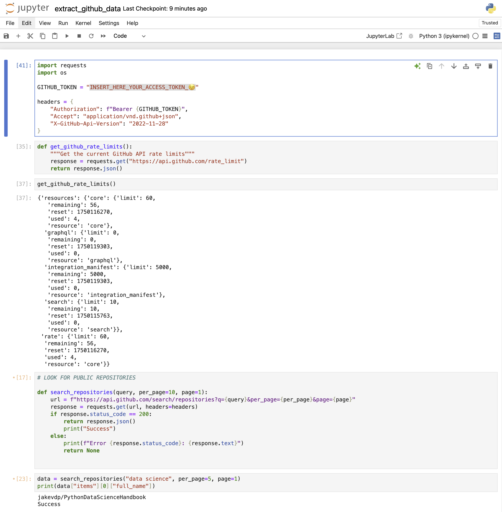

# Data Source API Analyst Test

This repository contains my technical test for the Data Source API Analyst role. The objective was to demonstrate skills in API research, data extraction using the GitHub API, handling pagination, authentication, error management, and documenting the process effectively.

---

## 🔍 Objective

- Research GitHub API endpoints to meet the client’s needs: public repositories, commits, and file contents.
- Use Jupyter Notebook and curl command to extract and analyze data.
- Demonstrate the ability to troubleshoot issues like rate limits or authentication errors.
- Document the process clearly and cleanly for review.



---

## 🧱 Repository Structure

```
data-source-api-analyst-test/
│
├── README.md # Project overview and reflections
│
├── Content/
│ ├── api_documentation.md # Endpoints researched and request logic
│ ├── extract_github_data.py # Python script for data extraction via GitHub API
│ ├── error_handling.md # Common error handling and troubleshooting
│ └── pagination_handling.md # Pagination logic explanation
│
└── Data_Collection/
  └── extract_github_data.ipynb # Jupyter notebook with implementation
```
---

## 🚀 Approach & Tools

- **API**: GitHub REST API v3
- **Jupyter Notebook**: API requests, authentication, and pagination.
- **Languages**: `Python 3`
- **Tools**: `requests`, curl, Markdown

---

## ⚙️ What’s Included

- Sample functions to retrieve repository lists, commit history, and file contents.
- Handling of API tokens via environment variables to avoid hardcoding credentials.
- Error handling for common HTTP response codes (401, 403, 404, 422).
- Clean documentation of each step in `/Content`.

---

## 💡 Reflection

This assignment allowed me to combine practical API usage with structured documentation. It was an opportunity to simulate a real-world data extraction scenario, working with authentication and limitations set by GitHub.

One key learning was how to balance script modularity and clarity in Colab for demonstration purposes, while also maintaining a production-ready `.py` version.

---
